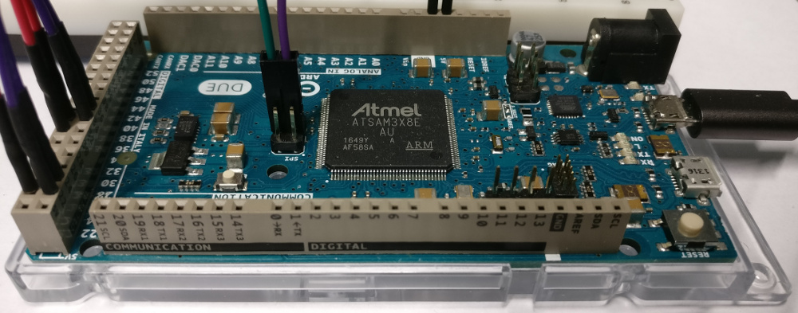
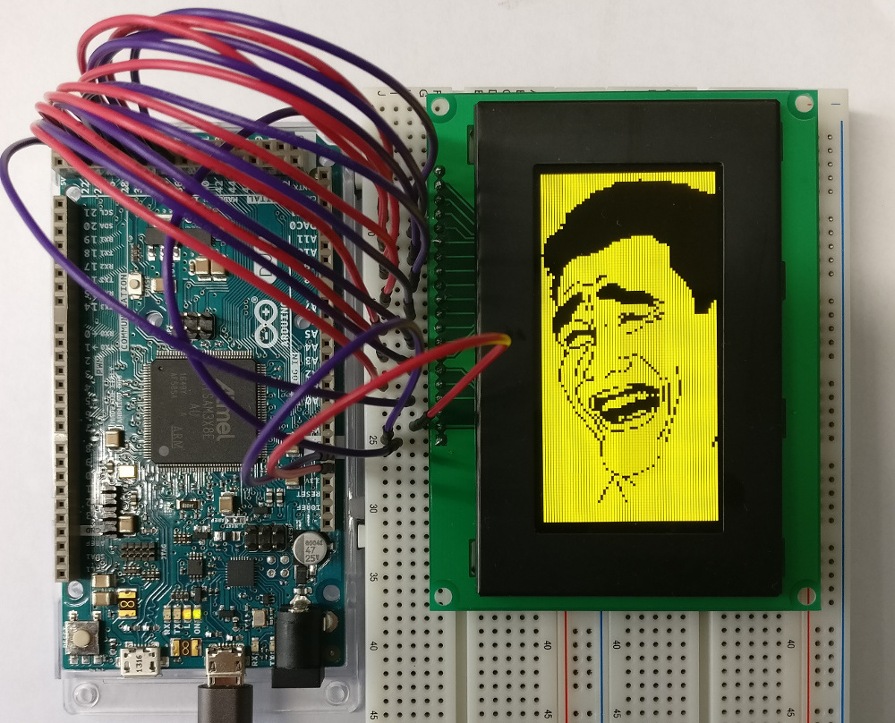

# ARDUINO Library for OLED Display VGY12864L-03
## Objective
The Arduino library for the display present has been developed to offer several methods to deal with display functionalities as discribed in the manual specifications.
## Usage
	For this purpose see the example Arduino sketch located in the examples folder. Also see the header file in the src folder. Read the comments and invesigate public methods listed. If SPI interface is used use the Arduino pins labeled SPI and not ICSP (see picture below).

### Datasheet
[Datasheet - VGY12864L](extras/OLED_DISPLAY_VGY12864L_S003_128X64.pdf)
## Exemplary Usage
	Somehow I have been highly motivated to get an arbitrary image being displayed on the display. Therefore I've written a [Python script](https://github.com/postfixNotation/ImageToArrayHeader) which converts an image into an "image.h" header file containing an array of bytes. Each bit of the byte determines whether a pixel is set or not. The result can be seen in the photo below.

